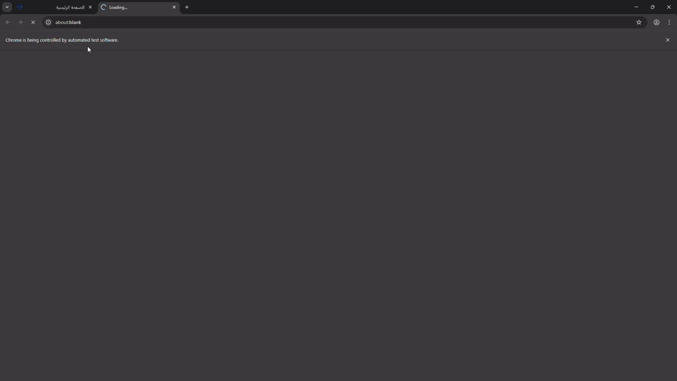

## Installation

1. Clone or download this repository:

   ```bash
   git clone https://github.com/samikayyal/Automatic-PSUT-Course-Registration
   ```

2. Install the required dependencies:

   ```bash
   pip install -r requirements.txt
   ```

## Configuration

Before running the script, you need to configure your credentials and course information:

1. **Set your credentials** in `main.py`:

   ```python
   USERNAME: str = "your_psut_username"
   PASSWORD: str = "your_psut_password"
   ```

2. **Add your desired courses** to the `userInfo` list:

   ```python
   # Example
   userInfo: List[CourseInfo] = [
       CourseInfo(
           name="Course Name",
           course_number=12345,
           section_number=1
       ),
       # Add more courses as needed
   ]
   ```

### Course Information Format

- **name**: Descriptive name for the course (Doesnt have to be accurate)
- **course_number**: The official course number from PSUT
- **section_number**: The section number you want to register for (e.g., 1, 2, 3)

## Usage

1. Ensure you have configured your credentials and course list correctly
2. Run the script
3. The script will:
   - Open Chrome browser
   - Navigate to PSUT portal
   - Log in with your credentials
   - Navigate to the course registration section
   - Attempt to register for each specified course
   - Provide real-time feedback in the console

## Important Notes

1. **Login Issues**:
   - Verify your username and password are correct
   - Check if your account is not locked

2. **Course Not Found**:
   - Verify the course number is correct
   - Ensure the course is available for registration
   - Check if the specified time/day combination exists

3. **Timeout Issues**:
   - Increase the `TIMEOUT` value if registration takes longer
   - Check your internet connection

4. **Incorrect Values Provided**
   - If the provided username and password are incorrect, the script will simply not log in
   - However, if the provided course numbers are incorrect or have no sections open, the script will enter an infinite loop

5. Always test the script during trial registration periods to ensure it works correctly with your specific course requirements before using it during actual registration periods.

6. Make sure that the courses you provide don't overlap.

7. Don't click anywhere in the browser while the script is executing.

## Demo


